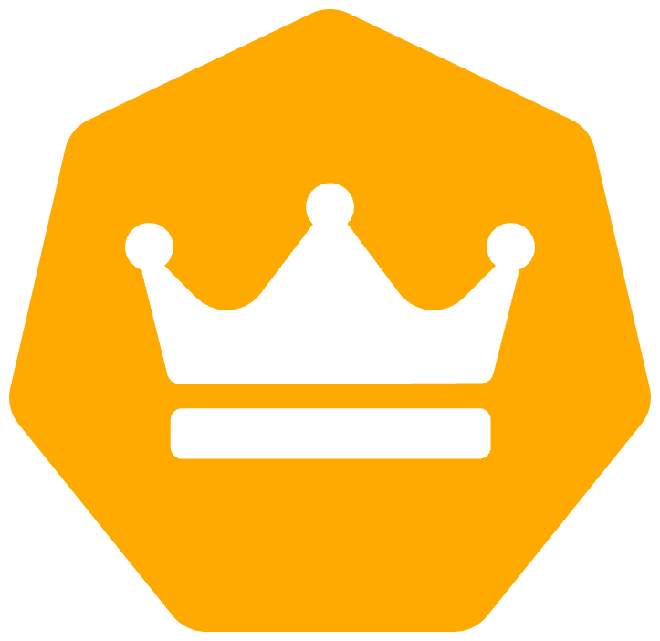

<h1 align="center" id="title">Midas</h1>

<strong>Управляйте ценами лёгким касанием руки.</strong>

<h2>🎯 Helm-чарты:</h2>

Предоставляемые Helm-чарты позволят поднять:

* API и MongoDB ReplicaSet
* Frontend-панель

API и СУБД рекомендуется держать на одном кластере, однако если есть потребность в репликации данных на разные ДЦ, то стоит рассматривать NFS, либо проприетарные методы репликации у Cloud-провайдеров. Все зависит от <strong>вашей</strong> инфраструктуры.

API и панель аналитика являются stateless приложениями, в то время как СУБД нужно постоянное хранилище.

Разработка и развертка демо проводилась на K3S кластере, развернутом при помощи [h2m](https://github.com/hiimluck3r/h2m).

<h2>💻 Создано при помощи:</h2>

Использованные технологии:

*   Helm
*   K3S
*   Bash
*   Proxmox

<h2>🛡️ Лицензия:</h2>

Проект распространяется по лицензии MIT

<h2>🐛 Баги и вопросы:</h2>

Создайте Issue с необходимым тегом:
* Feature request
* Bug report
* Question

<h2>💖Понравился проект?</h2>

Тогда поставьте нам звезду :)