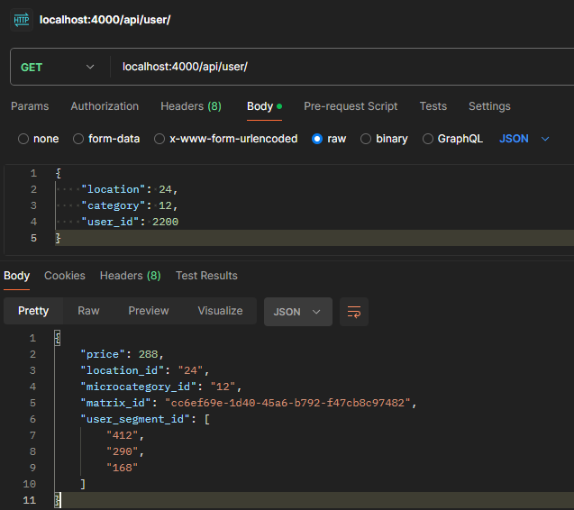

<h1 align="center" id="title">Midas - Backend</h1>

<p align="center"></p>

<p align="center" id="description"><strong>Управляйте ценами лёгким касанием руки.</strong></p>

<h2>🎯 Описание:</h2>

Данный package позволит API для взаимодействия с СУБД, созданием новых Baseline и Discount матриц, storage и банальной отдачи цен пользователю.

<h2>🛠️ Backend</h2>

##### Про алгоритм
1. Получает сегменты пользователя  
2. Сравнивает сегменты, указанные в storage, с сегментами пользователя
3. Находит всех родителей локаций и категорий
4. На этом этапе имеем 3 массива: сегменты, родители локаций, родители категорий. С помощью тройного вложеннго цикла происходит обход по ним. Это плохо...
5. Если на 4 этапе нужный документ не был найден, то с помощью двойного вложенного цикла (локации и категории) происходит обход по baseline матрице



##### API сервера
- GET: https://api.novodigital.ru/api/admin/ - возвращает все матрицы
- GET: https://api.novodigital.ru/api/admin/:uuid/:page - возвращает 20 документов, зависящих от page из матрицы, имеющую указанный uuid.
- POST: https://api.novodigital.ru/api/admin/ - создает копию матрицы, указанной в body запроса, и изменяет документы, указанные там же. Пример body:
```json
{
    "dbID": "uuid",
    "arr_obj":[
        {
            "_id": "id",
            "newPrice": price
        },
        {
            "_id": "id",
            "newPrice": price
        }
    ]
}
```
- GET: https://api.novodigital.ru/api/admin/storage - возвращает активный storage
- POST: https://api.novodigital.ru/api/admin/storage - создает storage, указанный в body:
```json
{
    "baseline": "baseline_uuid",
    "discount":[
        {"segment":"discount_uuid"},
        {"segment":"discount_uuid"}
    ]
}
```
- GET: https://api.novodigital.ru/api/user/ - возвращает результат работы алгоритма. В body:
```json
{
    "location": location_id,
    "category": category_id,
    "user_id": user_id
}
```
<h2>💻 Создано при помощи:</h2>

Использованные технологии:

*   ghcr.io
*   GitHub Actions
*   Docker
*   NodeJS
*   ExpressJS
*   MongoDB

<h2>🛡️ Лицензия:</h2>

Проект распространяется по лицензии MIT

<h2>🐛 Баги и вопросы:</h2>

Создайте Issue с необходимым тегом:
* Feature request
* Bug report
* Question

<h2>💖Понравился проект?</h2>

Тогда поставьте нам звезду :)