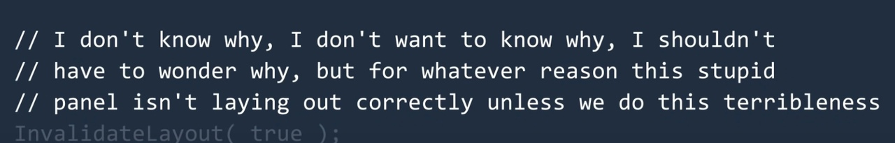

<h1 align="center" id="title">Midas - Panel</h1>

<strong>Управляйте ценами лёгким касанием руки.</strong>

<h2>🎯 Описание:</h2>

Данный package позволит запустить панель аналитика для удобного взаимодействия с API ценообразования и отдачи.

<h2>🔀 Блок 2:</h2>

<h2>💻 Создано при помощи:</h2>

Использованные технологии:

*   ghcr.io
*   GitHub Actions
*   Docker
*   React
*   NodeJS
*   Vite

<h2>🛡️ Лицензия:</h2>

Проект распространяется по лицензии MIT

<h2>🐛 Баги и вопросы:</h2>

Создайте Issue с необходимым тегом:
* Feature request
* Bug report
* Question

<h2>💖Понравился проект?</h2>

Тогда поставьте нам звезду :)

---

